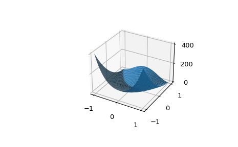

# Scientific Python (NumPy, SciPy, & pandas)

Python has two large communities: web development and scientific computing. Each group has a few core packages that they add on top of base python. In this section, we will 

## NumPy

The first package we will add to python is [NumPy](https://numpy.org/doc/stable/). To [install `numpy`](https://numpy.org/install/), type `conda install numpy` or `pip install numpy` depending on what package manager you are using. 

I then recommend reading the NumPy beginners guide at https://numpy.org/doc/stable/user/absolute_beginners.html. I will only be able to summarize it here. 

### Importing NumPy

```python
import numpy as np
```

We use the python keyword `import` to bring `numpy` into our namespace. However, we rename it to `np` because we are lazy. Using `np` is a convention.

### What is NumPy?

### Array basics

```python
a = np.array([1,  2,  3,  4,  5,  6,  7,  8,  9, 10])
```


#### Slicing

```python
data = np.array([1, 2, 3])
data[1]
data[0:2]
data[1:]
data[-2:]
```


Note that in the above image it does not clearly show that `data[0]` and `data[1]` return the scalar value at those indices and not an array. However, `data[:0]` will slice `data` and return a one element array `[1]`.

```{important}
Do not use `np.append()` if possible. and especially inside loops. NumPy arrays are similar to C-arrays, so all objects are next to eachother in memory. Therefore, appending to a numpy array needs to copy the entire array. Doing this once is ok, doing this inside a loop can take a lot of time. 

This is not a feature of Python lists. Therefore, if you need to build up an array, do it as a list then convert it to an array.
```

#### 1D vs 2D

```
>>> a = np.array([1, 2, 3, 4, 5, 6, 7])
>>> a.shape
(7,)
>>> a
array([1, 2, 3, 4, 5, 6, 7])
>>> a.T
array([1, 2, 3, 4, 5, 6, 7])
>>> a.T.shape
(7,)
>>> a = a[:, np.newaxis]
>>> a
array([[1],
       [2],
       [3],
       [4],
       [5],
       [6],
       [7]])
>>> a.shape
(7, 1)
>>> a.T.shape
(1,7)
```

In 2D arrays, the axis are (row, column).

#### Copies vs Views


NumPy uses both [copies and views](https://numpy.org/doc/stable/user/quickstart.html#quickstart-copies-and-views). 

```python
x = np.array([1,2,3])
z = x
print(z is a)
print(x, z)
z[1] = 5
print(z is a)
print(x, z)
```

Learn to use `copy()` when needed.


#### Arrays vs Lists

```python
a * 2
```

What if `a = np.array([1, 2, 3])` vs `a = [1, 2, 3]`? In NumPy this is called [broadcasting](https://numpy.org/doc/stable/user/absolute_beginners.html#broadcasting).


np.zeros, np.ones. 
```{note}
If you know the size of your final array, use np.zeros or np.empty then fill the array indexes with values. This is significantly faster than using np.append.
```

### Random numbers

One of the most used features in NumPy is getting random numbers. NumPy has an excellent [tutorial](https://numpy.org/doc/stable/reference/random/index.html), but note, NumPy had a major change to how you should create random numbers in 

https://realpython.com/numpy-random-number-generator/


```python
import numpy as np
rng = np.random.default_rng()

rng.uniform()
rng.uniform(low=3.4, high=5.6)
rng.integers(3)
rng.random(size=(5,))
rng.random(size=(3, 4, 2))
rng.standard_normal(size=(5,1))
```

`.random` returns random floats in the half-open interval [0.0, 1.0).

```{note}
What if I need to get the same random number the next time I run my code? Use a seed when setting up your random generator `rng = np.random.default_rng(12345)`.
```

## SciPy

SciPy has a lot of useful features. We will predominately use it `optimize` and `stats` modules. However, you may need its Fourier transforms, numerical integration methods, interpolations, Linear Algebra, image processing, and signal processing modules.

### scipy.optimize

The `scipy.optimize.minimize` function minimizes a functions, given as starting set of values (`x0`) and a few options [docs](https://docs.scipy.org/doc/scipy/reference/generated/scipy.optimize.minimize.html#scipy.optimize.minimize), [tutorial](https://docs.scipy.org/doc/scipy/tutorial/optimize.html#local-minimization-of-multivariate-scalar-functions-minimize).

Lets look at fitting a built-in SciPy function, the Rosenbrock.
```
sum(100.0*(x[1:] - x[:-1]**2.0)**2.0 + (1 - x[:-1])**2.0)
```


```python
>>> from scipy.optimize import minimize, rosen
>>> x0 = [1.3, 0.7, 0.8, 1.9, 1.2]
>>> res = minimize(rosen, x0, method='Nelder-Mead', tol=1e-6)
>>> res.x
array([ 1.,  1.,  1.,  1.,  1.])
```

We can also look at bounded and constrained minimizations [tutorial](https://docs.scipy.org/doc/scipy/tutorial/optimize.html#bounded-minimization-method-bounded).

```python
fun = lambda x: (x[0] - 1)**2 + (x[1] - 2.5)**2

cons = ({'type': 'ineq', 'fun': lambda x:  x[0] - 2 * x[1] + 2},
 {'type': 'ineq', 'fun': lambda x: -x[0] - 2 * x[1] + 6},
 {'type': 'ineq', 'fun': lambda x: -x[0] + 2 * x[1] + 2})
 
bnds = ((0, None), (0, None))

res = minimize(fun, (2, 0), method='SLSQP', bounds=bnds, constraints=cons)
res.x
```

### scipy.stats

From the SciPy documentation:

> This module contains a large number of probability distributions, summary and frequency statistics, correlation functions and statistical tests, masked statistics, kernel density estimation, quasi-Monte Carlo functionality, and more.
> 
> Statistics is a very large area, and there are topics that are out of scope for SciPy and are covered by other packages. Some of the most important ones are:
>
> * statsmodels: regression, linear models, time series analysis, extensions to topics also covered by scipy.stats.
> * Pandas: tabular data, time series functionality, interfaces to other statistical languages.
> * PyMC: Bayesian statistical modeling, probabilistic machine learning.
> * scikit-learn: classification, regression, model selection.
> * Seaborn: statistical data visualization.
> * rpy2: Python to R bridge.

We will be covering all of these other packages later in the semester.

We will use three subsections of `scipy.stats`:

* `scipy.stats` has a lot of discrete, continuous, and multivalent distributions. This adds to NumPy with distributions such as an exponentially modified Normal, a Half-Cauchy, a power law, a Laplace, multivariate_normal, a Special Orthogonal matrix (SO(N)), a Poisson discrete, and a binomial discrete.
* `scipy.stats` has advanced summary statistics such as moments, trimmed mean, kurtosis, and weighted geometric mean. It can even computer a binned statistic for one or more sets of data.
* And it even has the functions we need for Hypothesis testing (week 4).


```
from scipy.stats import lognormal, skew


```


## pandas

pandas is a package for working with tabular data. Above we asked if NumPy 2D arrays were (row, column) vs (column, row). For tabular data specifically, it should be assign the axes to observations and variables.

pandas has a great ["10 minutes to pandas"](https://pandas.pydata.org/pandas-docs/stable/user_guide/10min.html) tutorial. Read this tutorial.

## tidydata

## Reading in data

## Suggested Reading

* Vasiliev "Python For Data Science" chapter 3 "Python Data Science Libraries"
* Vasiliev "Python For Data Science" chapter 4 "Accessing Data From Files and APIs"
* https://numpy.org/doc/stable/user/absolute_beginners.html
* https://numpy.org/doc/stable/reference/random/index.html
* https://realpython.com/numpy-random-number-generator/
* https://www.w3schools.com/python/scipy/index.php
* https://docs.scipy.org/doc/scipy/tutorial/optimize.html#local-minimization-of-multivariate-scalar-functions-minimize
* https://docs.scipy.org/doc/scipy/tutorial/optimize.html#bounded-minimization-method-bounded
* https://pandas.pydata.org/pandas-docs/stable/user_guide/10min.html
* https://www.w3schools.com/python/pandas/default.asp
* https://colab.research.google.com/notebooks/mlcc/intro_to_pandas.ipynb
